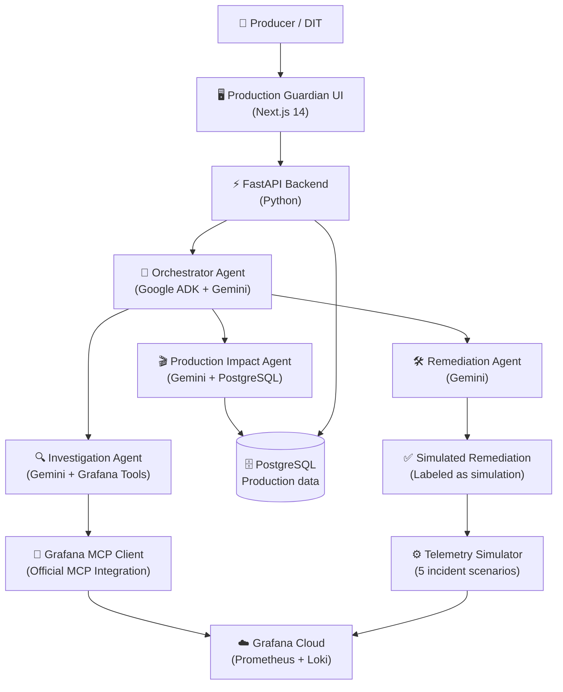

# Production Guardian

> **Turn production telemetry into production decisions.**

Production Guardian is an AI-powered autonomous operations system for film and media production. It monitors synthetic production infrastructure telemetry, investigates incidents through **Grafana Cloud MCP**, uses **Google Gemini + Google ADK** to reason over technical and production data, predicts the impact on film production, recommends remediation, waits for human approval, and verifies recovery.

---

## 🎬 The Problem

Traditional infrastructure monitoring tells engineers:

> *"Disk utilization is 96%."*

But a film producer needs to know:

> *"Will this prevent today's footage from reaching editorial?"*

**Production Guardian connects technical telemetry to production context.**

---

## ✨ What It Does

For a film production called **NIGHTFALL** on **Production Day 47**, with **Scene 42** as the critical workflow:

1. **Detects** infrastructure incidents from telemetry
2. **Investigates** via Grafana Cloud MCP (real tool calls, no fakes)
3. **Correlates** evidence across storage, network, camera, and editing systems
4. **Diagnoses** root cause using Google Gemini
5. **Predicts** impact on Scene 42 editorial deadline
6. **Recommends** specific remediation actions
7. **Waits** for human approval
8. **Simulates** safe remediation
9. **Verifies** recovery via Grafana

---

## 🏗️ Architecture



---

## 🤖 Agent Architecture

```
OrchestratorAgent (Google ADK LlmAgent)
├── InvestigationAgent
│   ├── query_metric()        → Grafana MCP → Grafana Cloud
│   ├── compare_baseline()    → Grafana MCP → 24h comparison
│   ├── query_logs()          → Grafana MCP → Loki
│   └── get_active_alerts()   → Grafana MCP → Alertmanager
│
├── ProductionImpactAgent
│   ├── get_production_context()   → PostgreSQL
│   ├── get_scene_context()        → PostgreSQL
│   └── calculate_impact()         → Deterministic math
│
└── RemediationAgent
    ├── generate_recommendations() → Gemini
    ├── simulate_remediation()     → Simulator state
    └── verify_recovery()          → Grafana MCP
```

---

## 🛠️ Technology Stack

| Layer | Technology |
|-------|-----------|
| AI | Google Gemini 1.5 Pro + Google ADK |
| Observability | Grafana Cloud (Prometheus + Loki) |
| MCP Integration | Official `mcp-grafana` binary |
| Backend | Python 3.11+ / FastAPI / Pydantic |
| Frontend | Next.js 14 App Router / TypeScript / Tailwind CSS |
| Charts | Recharts |
| Database | PostgreSQL + SQLAlchemy + Alembic |
| Telemetry | Prometheus Remote Write |
| Deployment | Google Cloud Run (documented) |

---

## 📦 Project Structure

```
production-guardian/
├── apps/
│   ├── api/                    # FastAPI backend
│   │   ├── main.py             # Entry point
│   │   ├── config.py           # Pydantic Settings
│   │   ├── agents/             # Gemini/ADK agents
│   │   ├── integrations/
│   │   │   └── grafana_mcp/    # Official MCP integration
│   │   ├── api/routes/         # FastAPI endpoints
│   │   ├── models/             # SQLAlchemy models
│   │   └── schemas/            # Pydantic schemas
│   │
│   └── web/                    # Next.js 14 frontend
│       ├── app/                # App Router pages
│       └── components/         # React components
│
├── simulator/                  # Telemetry simulator
│   ├── engine.py               # State machine
│   ├── generator.py            # Metric generation
│   ├── pusher.py               # Prometheus remote write
│   └── scenarios/              # 5 incident scenarios
│
├── database/
│   ├── migrations/             # Alembic migrations
│   └── seed/                   # Demo data seeder
│
├── grafana/
│   └── dashboards/             # Dashboard JSON
│
├── tests/                      # Unit + integration tests
├── docs/                       # Documentation
├── .env.example                # Configuration template
└── docker-compose.yml
```

---

## 🚀 Quick Start

### Prerequisites

- [Docker Desktop](https://www.docker.com/products/docker-desktop/) (recommended for simplest 1-command startup)
- Or locally: Python 3.11+, Node.js 18+, and Docker for PostgreSQL

### Configuration

Copy [.env.example](.env.example) to `.env` and provide your Google Gemini API key and Grafana Cloud credentials:
```bash
cp .env.example .env
```

---

### Method 1: Docker (Fastest & Recommended) 🐳

Run the entire system (Database, FastAPI with built-in Grafana MCP, Telemetry Simulator, and Next.js Frontend) with a single command from the project root:

```bash
docker compose up -d
```

That's it!
- **Frontend Dashboard**: [http://localhost:3000](http://localhost:3000)
- **API & Landing Page**: [http://localhost:8000](http://localhost:8000)
- **API Swagger Docs**: [http://localhost:8000/api/docs](http://localhost:8000/api/docs)
- **Grafana MCP Gateway**: [http://localhost:8000/mcp](http://localhost:8000/mcp)

---

### Method 2: Local Development Setup

If you prefer running services directly on your host machine:

#### 1. Start PostgreSQL
```bash
docker compose up postgres -d
```

#### 2. Seed the Database
The seed script automatically initializes tables and populates Scene 40–45 demo data:
```bash
python database/seed/seed.py
```

#### 3. Start Backend & Built-in Grafana MCP
The FastAPI backend serves the REST API and the built-in MCP server (`/mcp`) proxying to Grafana Cloud with zero external binaries needed:
```bash
python -m uvicorn apps.api.main:app --reload --port 8000
```

#### 4. Start Telemetry Simulator (in a second terminal)
Pushes live telemetry to Grafana Cloud every 15 seconds:
```bash
python simulator/service.py
```

#### 5. Start Web Frontend (in a third terminal)
```bash
cd apps/web
npm install
npm run dev
```

#### 6. Open Application
Navigate to [http://localhost:3000](http://localhost:3000).

---

## 🔑 Environment Variables

See [.env.example](.env.example) for all required variables with documentation.

Key variables:

| Variable | Purpose |
|----------|---------|
| `GOOGLE_API_KEY` | Google AI Studio API key for Gemini |
| `GEMINI_MODEL` | Gemini model (default: `gemini-1.5-pro`) |
| `GRAFANA_URL` | Your Grafana Cloud stack URL |
| `GRAFANA_SERVICE_ACCOUNT_TOKEN` | Grafana service account token |
| `GRAFANA_MCP_URL` | Grafana MCP server URL |
| `GRAFANA_PROMETHEUS_REMOTE_WRITE_URL` | Prometheus remote write endpoint |
| `DATABASE_URL` | PostgreSQL async connection string |

---

## 🎭 Incident Scenarios

| Scenario | Primary Signal | Counter-indicators |
|----------|---------------|-------------------|
| **Storage Saturation** | `storage_utilization` ↑ → `write_latency` ↑ → `ingest_throughput` ↓ | Network, cameras normal |
| **Network Degradation** | `packet_loss` ↑, `latency` ↑, `bandwidth` ↓ | Storage, cameras normal |
| **Camera Failure** | `camera_temperature` ↑ → `recording_errors` ↑ → `dropped_frames` ↑ | Storage, network normal |
| **Render Bottleneck** | `gpu_usage` ↑ → `render_queue` ↑ → `render_latency` ↑ | Storage, network, cameras normal |
| **Media Integrity** | `checksum_errors` ↑ → `failed_uploads` ↑ → `retry_rate` ↑ | Network, cameras normal |

---

## 🎬 Demo Flow

See [docs/demo.md](docs/demo.md) for the complete demo walkthrough.

**Summary:**
1. Open Production Guardian → See NIGHTFALL dashboard
2. Select "Storage Saturation" → Click "Simulate Incident"
3. Watch metrics degrade in real time (pushed to Grafana)
4. Click "Investigate with Agent" → Watch Gemini investigate via Grafana MCP
5. See root cause: "Storage saturation on INGEST-01 (94% confidence)"
6. See production impact: "47-minute editorial delay for Scene 42"
7. Click "What if we do nothing?" → See downstream cascade
8. Review and approve remediation
9. Watch telemetry recover
10. Gemini verifies recovery: "CRITICAL → LOW"

---

## 🧪 Testing

```bash
# Unit tests
cd production-guardian
python -m pytest tests/unit/ -v

# Integration tests (requires running PostgreSQL)
python -m pytest tests/integration/ -v

# Frontend type check
cd apps/web
npx tsc --noEmit

# Frontend lint
npx eslint . --max-warnings 0
```

---

## 🔒 Security

- All Grafana and Gemini credentials remain **server-side only**
- Frontend never sees API keys or tokens
- All remediation operations are **simulated** — no real systems modified
- Parameterized database queries throughout
- Input validation on all API endpoints

---

## ⚠️ Limitations

- This is a hackathon demo using **synthetic telemetry** for NIGHTFALL
- Remediation is **simulated** — labeled clearly in the UI
- Production impact calculations use **demo-calibrated parameters**
- The MCP integration requires the `mcp-grafana` binary to be running

---

## 🔮 Future Work

- Real production system integrations (media servers, camera systems)
- Multi-production support
- Historical incident analysis
- Predictive alerting before incidents occur
- Integration with post-production workflow systems

---

## 📄 License

MIT License — see [LICENSE](LICENSE)

---

*Built for the Agentic Cinema Hackathon — Grafana Labs Track*
